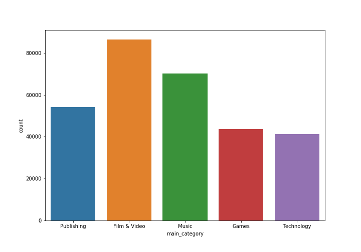

# Kickstarter Projects Analysis :hand: fa18-523-60, fa18-523-64, fa18-523-72

| Izolda Fetko, Nishad Tupe, Vishal Bhoyar
| ifetko@iu.edu, ntupe@iu.edu, vbhoyar@iu.edu
| Indiana University
| hid: fa18-523-60, fa18-523-64, fa18-523-72
| github: [:cloud:](https://github.com/cloudmesh-community/fa18-523-60/blob/master/project-report/report.md)
| code: [:cloud:](https://github.com/cloudmesh-community/fa18-523-60/tree/master/project-report/bin)

---

Keywords: MongoDB, PyMongo, Crowdfunding, Virtual Machines, IaaS & DBaaS Cloud, Data Analysis, Predictions
          
---

## Abstract

Crowdfunding is a certain way of raising funds where 
individuals come together and collectively support projects 
by investing in them. Kickstarter is one of the leading 
crowdfunding platforms in the world that helps 
individuals/businesses in various categories such as art, 
film, music, theatre, games, design, and other, to raise 
necessary funds to complete their projects. This paper 
explores the utilization of big data technologies 
and cloud services such as MongoDB, virtual machines, 
MongoDB Atlas, DigitalOcean, AWS, and PyMonogo while 
analyzing the *Kickstarter Projects* dataset obtained 
from the Kaggle datascience platform.

## Introduction

Many creative individuals and groups around the globe are trying 
to develop products, projects, and businesses based on their 
unique ideas and talents. In many cases, an idea or a talent 
is not enough to accomplish this. Capital funds are one of the 
main elements of a successful start-up process. Although there 
is a significant number of government programs in the United 
States designed to help small businesses and creative indivials 
to obtain necessary funds for their projects, a high number of 
start-ups nonetheless remain capital constrained [@www-voelker]. 
This is the reason why the *Kickstarter* platform was developed 
and is still successfully operating since 2009 [@www-voelker].

*Kickstarter* is a web-based crowdfunding platform that helps 
support creative arts around the globe [@www-voelker].
It uses the fundable project model where the would-be business 
owners or project managers submit their project along with the 
necessary project information and its funding goal.

> "The funding goal establishes a base target for the project 
> and a deadline (generally 30-days) to achieve the funding" 
> [@www-voelker]. 

The prospective artists and entrepreneurs typically display their 
projects in a video form where they have the opportunity to outline
the project along with its benefits and funding requirements 
[@www-voelker]. The video is shown on the *Kickstarter* project 
webpage along with the number of backers, the amount of funds 
received/pledged as well as the fundraising goal. Since each project 
is timed, the time remaining in the *Kickstarter* promotion is 
shown on the project page as well. The platform is based on 
an *all or nothing* funding model which means that the pledged 
funds are not available to the entrepreneurs until the end of 
the funding period, which is determined by the goal-setting 
statement [@www-voelker]. The financial transcations occur only 
in cases where projects meet their initial targets and funding 
expectations [@www-voelker]. If the initial target is exceeded, 
the project receives all funding as well as the excess of its goal.

Our project includes several big data technologies while exploring 
the *Kickstarter* dataset collected in the 2009-2018 timeframe and 
made public via Kaggle, a well known datascience platform. The base
technology used to store and query the dataset is the widely known
NoSQL database called MongoDB. Three cloud services chosen to be 
benchmarked against each other are MongoAtlas, DigitalOcean, and 
AWS. Our team had developed a Python program and a packaged shell 
script that builds the MongoDB environment on a Unix platform, 
performs data analysis through visualizations to gain hidden insights  
and builds a logstic regression model to predict the success/failure
of the *Kickstarter* projects. MongoDB database is hosted on several 
cloud environments. The time needed to query the dataset was used 
as a quantitative measure to analyze the relative benchmarking. 
Moreover, our team provides an ease-of-use review of each service 
as an addition to the performance benchmarking. This report 
introduces the reader to the related work in the MongoDB realm, 
as well as to the chosen dataset prior to presenting the project 
design and research methods, architecture, technologies, and results. 

## Literature review

MongoDB and Python are both open source technologies. One can 
get started quickly by building an application on MongoDB using 
any of the languages that leverage MongoDB's driver. This database
offers a native driver called PyMongo to fit Python developer 
community needs.

> "MongoDB stores data in documents, however, they are not like 
> Microsoft Word or Adobe PDF documents but rather JSON documents 
> based on the JSON specification" [@www-pymongo].

There are several advantages of storing data in document format 
and some of them are flexible schema and ability to store arrays, 
which are faster to process using native commands of Python scripts 
[@www-pymongo]. In June 2018, students of the Indiana University, 
Bloomington Izolda Fetko, Rashmi Ray, and Nishad Tupe explored 
the France accidents dataset using MongoDB, PyMongo, and Tableau 
to provide safety recommendations. They used the newest release 
of the MongoDB driver called the  *Mongo BI connector* that 
allowed BI tools such as Tableau to interact with MongoDB. 
The BI connector converts the Tableau's SQL-like commands on 
structured data into the native MongoDB commands while fetching 
data [@www-mongotab]. The team also used PyMongo and other web 
technologies to build the website that could store, update, 
process the records live and can be accessed by the global audience. 
As MongoDB is a NoSQL engine, it scales easily for multiple tables 
as a single JSON object, and makes query retrieval speed faster 
than RDBMS, while avoiding complex joins. However, the research also 
showed that Tableau and MongoDB is a lousy marriage predominantly 
because Tableau was built before the NoSQL and Big Data were popular 
and is not yet mature to process relational data [@www-mongoknowi]. 
Tableau's slow processing of joins, when connected directly to 
MongoDB, was one of the main reason authors decided to join the 
CSV files using Pandas data frame and use MongoDB as a backend tool. 
This tool allows a stable platform for the user-friendly BI tools 
such as Tableau to perform analytics on large datasets with millions 
of rows and also to stand as a robust database on which one can 
build applications [@www-mongotab]. In the final step, authors 
created a website and provided links to various dashboards 
using technologies such as HTML, CSS, JavaScript, Bootstrap, 
Flask, JQuery, and Chartist [@www-mongotab]. Although the goals 
of the aforementioned and our current project differ, they do share 
a lot of similarities such as using the exact same big data 
technologies MongoDB and Python. 

Another paper written by [@www-matei], presents an interesting
benchmarking of the MongoDB database on several cloud instances.
In his report, [@www-matei] notes that each virtual instance created
for this purpose had MongoDB and PyMongo installed on it. The 
similarity between this report and our project is that both 
exploit the benefits of the PyMongo driver and the Amazon Web 
Services, more specifically the *EC2* instances. In addition to the 
AWS, [@www-matei] used Linode, a hosting company that offers a virtual 
private server (VPS); Rackspace cloud and its open source technology 
*OpenStack*; and Windows Azure and its virtual machines [@www-matei].
In the final section of his paper, [@www-matei] concludes that MongoDB's 
performance varies from cloud to cloud due to various factors. One of 
the most important factors that he lists are the fast I/O access and 
ability of the database to cach all indexes in RAM [@www-matei].

The report by [@www-bigbee] shows similarities with our report 
in the sense that is conducting benchmarking of MongoDB using 
the Amazon Web Services. However, in his report, [@www-bigbee] 
takes a step further and compares the MongoDB performance to other
databases such as CouchDB and Apache Spark. He concludes that
MongoDB performs well on the cloud with ultra-low latency which 
makes it a great choice  for applications with flexible schema 
requirements [@www-bigbee].

The article written by [@www-sverchkov], presents NoSQL database
benchmarking with the use of the Yahoo Cloud Benchmark (YCSB) and 
Amazon Web Services with an installed Linux operating system 
[@www-sverchkov]. The purpose of his article is to help developers 
choose the right database for their application. He tested Cassandra 
2.0, MongoDB 2.4.6, HBASE 0.92 and concluded that developers 
need to evaluate different solutions in their search, and test
their performance first prior to making any decisions [@www-sverchkov]. 
According to him, all databases are good in some way, but may perform 
differently in different scenarios, hence, it is important to chose them
based on the most needed properties and project requirements
[@www-sverchkov]. The similarity between this project and our project 
is the use of the Amazon Web Services as a benchmarking tool for 
MongoDB. 

## Dataset Description

### Kaggle API

The technology used to easily obtain the *Kickstarter Projects* 
dataset is the newly offered Kaggle Public API. API stands for 
*Application Programming Interface* through

> "which interactions happen between an enterprise and applications 
> that use its assets" [@www-apiwiki].

Kaggle Public API was launched in February 2018 and can be used for 
*creating datasets, kernels*, or simply *connect with Kaggle* 
[@www-kaggleapi]. Although still in its beta phase, it allows a more 
user-friendly data download as well as a seamless workflow for 
its community members. To be able to use this technology, users 
need to ensure that they had installed the latest Python 3 version 
on their machines as well as the pip package manager [@www-githubkagapi].
Accessing the Kaggle API is done by using a simple command line; however, 
this is not possible until a Kaggle account is created 
[@www-githubkagapi]. Once the initial step had been completed, an 
API token can be created, which triggers a download of a JSON file 
that contains the user credentials necessary to access the API 
[@www-githubkagapi]. Once the sign-up had been finalized, various 
command lines can be used to access the list of competitions along 
with the files and submissions associated with them [@www-githubkagapi]. 
A different set of commands can be used for dataset downloads and 
dataset creation, while the final group of commands listed on the 
Kaggle API GitHub page are the commands to manage Kernels, more 
specifically Kernel pull and push [@www-githubkagapi].

The importance of the Kaggle's public API is significant. It minimizes 
the need for its users to manually download large datasets, hence saving 
them time when working on important projects. It is also helping students 
in expanding their knowledge and programming experience through practical 
examples and real-life data that can be later implemented in their 
professional work.

### Kickstarter Projects Dataset

The *Kickstarter Projects* dataset is publicly available on the Kaggle website
and can be accessed using this [path](https://www.kaggle.com/kemical/kickstarter-projects#ks-projects-201801.csv).
The instructions on how to obtain the dataset using the Kaggle API can be found
[here](https://github.com/cloudmesh-community/fa18-523-60/blob/master/project-report/dataset/Kaggle%20API%20and%20Dataset%20Download%20Instructions.txt).
The dataset is available in the CSV format and contains more than 370 thousand 
projects submitted to Kickstarter between 2009 and 2018 [@www-kaggle-kickstarterdata]. 
The dataset variables allow versatile data analysis which is presented in the 
*Observations and Visualizations* segment of our project. Other than the project 
ID, the dataset contains information on the project name; main category and 
category of campaign; currency used to support the project; fundraising goal 
(the amount of funds needed to complete the project); project launch (date); 
project crowdfunding deadline (date); state – current state of the project; 
actual funds pledged to the project along with the number of backers; the country 
of origin; and the total amount of funds pledged by currency [@www-kaggle-kickstarterdata].

## Design and Methods

One of the primary aims of the project was to utilize the minimal cost cloud 
resources. Thankfully, nowadays, every coud provider provides a free tier service. 
To leverage this, our team created VM's on Amazon Web Services (AWS), DigitalOcean 
cloud service with more or less the same basic configuration of memory and hard 
disk. The AWS and DigitalOcean are primarily an *IaaS* service, while MongoDB Atlas 
is a *DBaaS* . This gave us the opportunity to test the solution on various cloud 
providers and benchmark their performance with pros and cons. Although the cloud 
VM's gave us the lot more control and customization over the OS and database level 
resources, MongoDB Atlas cloud services provided a stable database clustered 
environment for high availability of data. There was no overhead of configuring 
MongoDB instance as it is a *DBaaS* service. We decided to leverage Unix bash script 
to perform a task automatically. The following bullet points outline the steps 
taken during our project:

-  Dataset Download
-  Install MongoDB 
-  Import MongoDB 
-  Conduct Python Analysis

Once the stable infrastructure foundation on the cloud based VM's was achieved, we moved
onto loading the data using two methods:  

-  Python script based method for DBaaS 
-  MongoImport for cloud VM's 

Before beginning the analysis, it is crutial to extract the essential 
features. We used Python datetime library to get the date, year, month; to
clean up the *NaN* rows carefully and also to calculate the duration of 
a project. The next step encompassed in data enhancement by extracting the 
features that can give a foundation to perform various analysis and develop 
a machine learning model. During the aforementioned process, our team had 
utilized the following methods to complete the data analysis and draw 
insights from the dataset. 

* Cloud and MongoDB set up

   The first step was to create a stable infrastructure to perform analysis.
   This method involved creating the cloud VM's,  and use the bash shell 
   scripts to complete the installations. We had also done some testing of 
   the MongoDB connectivity from various machines to the cloud instances. 
   Finally, we had created and prepared the architecture diagram.

* Exploratory Analysis and Visualization

   Data Visualizations that let one discover trends or patterns in
   a dataset are called the *Exploratory Data* analysis. Once the data
   is in a good shape, it is easier to gain insights by using
   visualizations that often become handy tools for finding
   interesting patterns.

* Correlation or Heatmap analysis
          
   The correlation analysis is a statistical method used to 
   evaluate a relationship between two continuous variables 
   [@www-correlation]. For example, we had used this type 
   of analysis to find relationships between project 
   categories and states.
                         
* Time-Series Analysis
          
   The time series analysis is a statistical technique which is related 
   to data that is distributed in a series of particular time periods or
   intervals [@www-timeseries]. We had used it to get a better 
   understanding of the distribution of the projects over years and
   months.
   
* Logistic Regression Model
          
   The logistic regression analysis is a predictive analysis
   used to describe a relationship between one dependent and 
   one or more nominal, ordinal, interval, or ratio-level 
   independent variables [@www-logreg]. We had used this
   model in our machine learning algorithm to predict 
   successful vs. failed project status.

* Perform MongoDB queries

   The gist of our project is to show the MongoDB ability to 
   query in real time, hence we used the MongoDB aggregation 
   framework to analyze the *Kickstarter* dataset as well.
   
## Technologies

### Technologies and Tools Used

* Python version 3.6 and various libraries such as Seaborn, Matplotlib, Pandas, and Scikit-learn
* PyMongo Driver, Bash Shell 
* Cloud service - MogoDB Atlas, 3 node replica cluster
* Cloud service - DigitalOcean, Ubuntu 18.04 ,MongoDB 3.6.3
* Cloud service - AWS , Amazon Elastic Compute Cloud (EC2), Ubunty 18.04, MongoDB 3.6.3

## Code Organization

Our code is checked-in on GitHub and can be accessed by using this 
[link](https://github.com/cloudmesh-community/fa18-523-60/tree/master/project-report/bin).
It is organized as described in the following section.

### bin

- [MongoDB_queries.txt](https://github.com/cloudmesh-community/fa18-523-60/blob/master/project-report/bin/MongoDB_queries.txt)
- [bash_envsetup_script.sh](https://github.com/cloudmesh-community/fa18-523-60/blob/master/project-report/bin/bash_envsetup_script.sh)
- [csv_to_mongo.py](https://github.com/cloudmesh-community/fa18-523-60/blob/master/project-report/bin/csv_to_mongo.py)
- [exploratory_analysis.ipynb](https://github.com/cloudmesh-community/fa18-523-60/blob/master/project-report/bin/exploratory_analysis.ipynb)
- [logistic_regression.ipynb](https://github.com/cloudmesh-community/fa18-523-60/blob/master/project-report/bin/logistic_regression.ipynb)	
- [main.py](https://github.com/cloudmesh-community/fa18-523-60/blob/master/project-report/bin/main.py)	
- [mongo_uninstall.sh](https://github.com/cloudmesh-community/fa18-523-60/blob/master/project-report/bin/mongo_uninstall.sh)
- [timeseries_analysis.ipynb](https://github.com/cloudmesh-community/fa18-523-60/blob/master/project-report/bin/timeseries_analysis.ipynb)


## Architecture

Since the beginning of our project, the team aimed to create a 
scalable Python code that can run seamlessly on different cloud 
environments. We mainly used cloud computing services from Amazon 
Web Services (*AWS*), *DigitalOcean* as *IaaS* and *MongoDB Atlas* as 
a *DBaaS* platform. Though *AWS* is giant a cloud provider with multiple 
cloud services, we found that *DigitalOcean's* user-friendly virtual 
machine (VM's) management interface is equally attractive. The architecture 
diagram (+@fig:architecture), more specifically the upper left dotted box, 
shows the client machine or application tier where the source code(*.py*) 
was stored and used for performance benchmarking. 

{#fig:architecture}

The team also kept a copy of the source code and other scripts on the cloud 
VM's file systems. We used PyMongo driver as one of the primary components 
for communicating with the MongoDB database. PyMongo does not only
provide the MongoDB driver access to Python libraries, but is also a 
recommended choice when wrangling data with MongoDB [@www-mongodbpymongo]. 

During the initial loading phase of the *Kickstarter* dataset, our team
imported the raw data using the MongoDB import command line in the 
*DigitalOcean* and *AWS* cloud VM's. A custom bash shell script that 
installs, configures the MongoDB environment and then imports the CSV 
data to MongoDB was also written. To load the data in the MongoDB 
Atlas cluster,  we used a simple Python function *load_csv.py*. The 
primary reason for this is because MongoDB Atlas is a *DBaaS* cloud 
service and typically in *DBaaS* users do not have control or access 
to OS resources such as a file system. In most basic form, our M0 
cluster consists of one primary node and two secondary nodes. The 
primary nodes are mainly responsible for writing operations, while 
the secondary nodes replicate primary's *oplog*. This way the 
secondary node's dataset reflects the primary's dataset in cases 
where the primary node is unavailable [@www-mongodbreplica]. Only 
the eligible secondary nodes will

> "hold an election to elect itself the new primary" [@www-mongodbreplica]. 

This replica set arrangement ensures high availability of the data. 
Optionally, one can configure the arbiter node which does not 
hold any data but keeps the track quorum in the replica set. Since 
arbiter nodes do not hold any data, they act as a suitable repository 
to keep the heartbeat information at a cheaper cost [@www-mongodbreplica]. 
On the contrary, our team had found that the *IaaS* services 
provide greater control and customization to the OS resources 
but add overhead to perform the configuration and other tasks 
which can be complex and may induce a lag time for writing the 
code due to incomplete pre-requisites. On the cloud VM's, the team 
hosted a single instance MongoDB database on Ubuntu 18.04 platform. 
As post install steps, our team had installed the Python Anaconda 
Distribution and other necessary libraries essential to complete 
the analysis. The communication between the MongoDB and Python
application happens by connecting string. The connect string, one must 
have a valid username and password and necessary privileges to access 
and modify the database. To accept the remote connection, one of the vital 
steps is to set a value of *bind_ip* to 0.0.0.0 in the *mongodb.conf* 
file that resides on the VM. For all cloud providers, our team had 
used free-tier services. We observed notable advantage of using 
MongoDB Atlas free tier service often called as *M0 cluster*. 
By default, the *M0 cluster* comes with three node replica sets 
and 512 MB storage. The replica set is a group of *mongod* processes 
which provide redundancy and high availability to the application 
while accessing the MongoDB data. 

## Observations and Visualizations

Our team completed an exploratory analysis of the *Kickstarter* dataset. 
The results of the analysis can be observed in the following sections.

### Exploratory Analysis

Our queries have determined that the *Kickstarter Projects* data includes 
six different project states such as failed, successful, canceled, live, 
suspended and undefined, as shown in +@fig:states_count. Due to the lack 
of funding, more than  300000 projects in the overall pool of projects 
had failed, while 200000 projects achieved the funding goal with a 
successful status. Approximately 70000 projects were canceled while 
others with with less significant counts were marked as live, suspended
and undefined. 
 
{#fig:states_count}
 
A more detailed view of the project counts was created for the main two 
state categories - successful and failed projects. The data visualization 
in +@fig:year_count shows that the highest number of projects were submitted
in 2015. Nearly 70000 projects failed to achieve their funding goal in the 
targeted time-frame. This was the highest count of failed projects in the 
history of *Kickstarter*. The number of successful projects has steadily 
increased since 2009 and shows a normal distribution over the years with lot 
less variance compared to failed projects. Overall, it can be concluded that 
the number of failed projects was much higher then the number of success 
projects in each year.

{#fig:year_count} 
 
The +@fig:top_market visualization is showing the best markets (countries) for 
funding projects. Based on this analysis, Austria appears to be the best country
for project funding. More than 800000 projects with pledged US dollars launched 
in Austria achieved their goal within deadline. It is followed by China and New 
Zealand, which have less successful projects but almost equal amount of failed 
projects as Austria.
 
{#fig:top_market} 
 
The heatmap visualization in +@fig:category_count is showing project state 
count against the main category. The scale represents highest count with 
yellow color and lowest count with dark blue color. The chart is showing 
highest successful project counts for the *Technology* main category followed 
by *Dance* and *Games* categories. The count of successful projects in the 
*Technology* main category was more than 80000.

{#fig:category_count} 

The projects recorded as *failed* are the ones that were not able to achieve 
funding goals between the project launched date and the project deadline date. 
There are some projects which started collecting funding however, were not able to
collect the targeted amount. The visualization in +@fig:remaining_fund is showing
the targeted funding goal data and actual funding collected for main categories. 
The *Film & Video* category has the highest funding goal and only 10% fund achieved 
by projects. The funding collection of the *Technology* category was the highest 
compared to the total fund goal.

{#fig:remaining_fund} 

The project fund duration is a measure that represents the day counts between 
the project launch date and the project deadline date. The duration box plot 
in +@fig:duration shows the average duration for successful and failed projects. 
The average duration of the successful projects was less than 31 days and the
average duration of the failed projects was more than 40 days. The median between 
successful and failed projects the duration at approximately 36 days.
 
{#fig:duration} 

### Time Series Analysis

The time-series analysis conducted by the team revealed certain trends in
the *Kickstarter* dataset which will be presented in the following segment.
One of the trends noticed was that the projects mostly get launched in the 
warmer months with July being the month with the highest number of projects.
The trend of the launched projects by month can be seen in +@fig:pjbym.

{#fig:pjbym}

Drilling further into the project by month data, as shown in +@fig:pjbyms,
one can notice that proportionally to the number of launched projects, 
July is the month with the highest number of cancelled and failed projecs. 
The number of live projects is higher in winter months, mostly in November 
and December, however, the overall number of projects drastically decreases 
most likely due to the holidays.

{#fig:pjbyms}

Looking at the same categories over the years time series, from +@fig:pjbyys 
one can conclude that overall, 2015 was a great year for *Kickstarter* with 
the highest number of submitted projects, but also, proportionally, one of
the highest number of failed projects.

{#fig:pjbyys}

When it comes to the countries from which the projects were submitted in the
2009-2017 timeframe, one can conclude that *Kickstarter* was popular and 
available only in the United States in the first four years of its activity.
In 2013, for the first time, one can notice other countries making project
contributions such as Canada and New Zealand. As one can notice in +@fig:pjbyyc, 
in the following years, the number of contributing countries rises, however, 
the leading one still remains the US.

{#fig:pjbyyc}

### Logistic Regression

In real life classification problems are more prevalent than regression. 
Logistic regression helps us solve classification problems by employing 
the sigmoid function. As shown in +@fig:sigmoid, logistic regression tells 
us about the probability as a cut off point [@book-ISLR].

{#fig:sigmoid}

The probability of belonging to a class is less than 50%. The values are 
assigned to class 0 and in our case, the classes were predefined as 
*success* or *failed*. Thanks to the scikit-learn logistic regression
model which takes care of the substantial mathematical part, we moved
forward with bulding a model that can predict future projects' states.

To build this model, we used the following steps: 

* Cleaning the dataset

* Extract projects with success and failed states only

* Explore dataset to predefine the classes

* Identify top 5 categories 

* Extract features and label data 

* Build the model 

* Predict and measure accuracy

The following figure (+@fig:selecttop5) shows categories with 
the highest number of succeeded and failed projects.

{#fig:selecttop5}

We decided to use features such as *'main_category', 'goal', 
'backers', 'duration', 'successful'* out of which *successful* 
feature was generated using pandas get_dummies method.  

`proj_state = pd.get_dummies(data=df_sf_t['state'], drop_first=True)`

The following figure (+@fig:categoryclass) shows the categorization of 
our input dataframe into two classes - successful and failed.

{#fig:categoryclass}

All the main categories were mapped to numerical values as shown in +@fig:labels 
so as to input them as numeric vectors to the machine learning algorithm.

`cats = {'Publishing':4,'Film & Video':1,'Music':2,'Games':5,'Technology':3}`

* Labeled Data Sample

|main_category| goal| backers| duration| succesful|
| --- | --- | ---| --- | ---| 
| 4 | 1000.0 | 0 | 58 | 0 |
| 1 | 30000.0 | 15 | 59 | 0 |

    
Once the data frame with labeled data was ready we followed the
standardized machine learning steps to build the model which  
involved creating the classifier object; splitting the train test 
dataset; fitting the model;  predicting values; and measure model 
accuracy. The following table shows the 
confusion matrix of our test dataset.

* Confustion Matrix (y-test)
 

| n=88758| Predicted No | Predicted Yes|
| --- | --- | ---|
| Actual No | TN = 50106 | FP = 2331 |
| Actual Yes | FN = 7043 |   TP = 29278 |


We used the five fold cross-validation method to measure the accuracy 
of the algorithm. We had found the average accuracy score was close to 
90%. To get more accuracy, this model can be extended to additional
features and also a larger set of classes. Our accuracy scores
can be seen in the following table

* Accuracy Scores 

| Cross Validations| Accuracy |
| --- | --- | 
| CV-1| 90.47 |        
| CV-2| 89.51 |        
| CV-3| 89.66 |  
| CV-4| 89.17 |        
| CV-5| 89.67 |         
| Average | 89.70 |

### MongoDB Queries

Our team had also had the opportunity to write MongoDB queries directly 
working in Mongo Atlas with a purpose of comparing the ease-of-use 
related to querying of the *Kickstarter* data between MongoDB and
Python. One of the queries included the count of projects by category.

```
> db.project.aggregate([
          {$group:{_id:{category:"$main_category"}, count:{$sum:1}}},
          {$sort:{count:1}}
          ])
```
The output of this query can be seen in +@fig:projbycat.

{#fig:projbycat}

From the results we can see that the highest number of the overall 
submitted projects was in the *Film and Video* category. This
makes sence when we take into consideration the number of
smart phones and camera devices in the world. These technologies
have made this art more available to amateurs. In a similar 
manner, the team had written a query to count the number of 
projects by year. 

```
> db.project.aggregate([
          {$group:{_id:{year:"$year"}, total_number_of_projects:
          {$sum:1}}},
          {$sort:{_id:1}}
          ])
```

The results in this query have shown that the number of projects
varied through out the years, and that the highest number of 
projects was submitted in 2015. Finally, a query that resembles 
the previous two is the total count of projects by project state,
which revealed that the vast majority of projects that get 
submitted also get funded.

```
> db.project.aggregate([
          {$group:{_id:{state:"$state"}, count:{$sum:1}}},
          {$sort:{count: -1}}
          ])
```

A slightly more complex query was used to compute the total amount of 
the pledged funds, number of backers (investors), and total funding 
goal by project category. Our team had determined that with more
complex queries, the output appeared less attractive and more 
difficult to read as it can be seen in +fig@:totalmetrbycat.

```
> db.project.aggregate([
          {$group:{_id:{category:"$main_category"}, tot_amt_pledged:
          {$sum:"$pledged"}, tot_backers:{$sum:"$backers"}, tot_goal:
          {$sum:"$goal"}}}
          ])
```

{#fig:totalmetrbycat}

In a similar fashion, the average metrics by category were 
obtained thanks to the following query: 

```
> db.project.aggregate([
          {$group:{_id:{category:"$main_category"}, avg_amt_pled:
          {$avg:"$pledged"}, avg_backers:{$avg:"$backers"}, avg_goal:
          {$avg:"$goal"}}},
          {$sort:{avg_amt_pled: -1}} 
          ])
```

{#fig:avgmetrbycat}

Although querying in MongoDB is relatively simple, the team had
concluded that compared to Python the output results are less
attractive, as it can be seen in +@fig:avgmetrbycat, and the 
overall usage is less friendly.  

## Conclusion

In this project, our team was able to deploy a successful 
Python application that has the capability of running on 
various cloud services using MongoDB as a stabile backend.
The team had observed that the performance was better on 
DigitalOcean and Amazon platforms (44 seconds) which have
a dedicated memory and CPU, as well are more costumization 
options, compared to the MongoDB Atlas cluster where it took
96 seconds to run the aforementioned Python script. Various
factors need to be taken into consideration when benchmarking
performance on different services. Some of them include load 
and dedicated resources such as CPU and memory, which play a 
very important role. Overall, we have concluded that each 
platform has its own advantages such as ease of use,
customization of the environments, however, one of the 
very important aspects also includes the cost of the offered
services. Our team had used the minimal cost approach in this
project, and ran the code on the available free tier level
services, which could have also affected the performance.
When it comes to the crowdfunding data, we have found that
the overall success rate of the *Kickstarter* projects in the
2009-2018 time frame was 36%, and that each year, the number of 
failed projects was much higher compared to their successful 
counterparts. We had also identified the most successful
categories - *Technology*, *Games*, *Publishing*, *Music*,
*Film & Video*. From those categories, *Technology*  and *Games*
were among the categories with the highest amount of pledged funds,
including *Design*. The highest number of successful projects 
was achieved in 2014 while the number of suspended projects 
was the highest in 2015. Overall, 2011 was the year of the 
highest success rate. By conducting the monthly time series 
analysis, we had identified certain trends where we could see
that warmer months yieled more project launchs while the
colder months were sub-sequentially less project heavy.
Although the platform was created in the United States, 
countries such as Austria , China, and Netherland shown 
to be the top countries for generating pledged funds.
Project duration was also analyzed and the team had concluded
that the average duration of the successful projects was less
than 30 days, while the upper limit for the maximum project
length was 45 days. Moreover, thanks to our implemented
machine learning methods, we were able to predict the 
success and failer of the projects based on the extracted 
features such as goal, backers, categories, and duration.
However, we also believe this model can be expanded with 
additional feature engineering and stimulate sponsors to
fund projects that are more likely to be successful with
the sole purpose of keep encouraging the start-ups.

## Acknowledgement

The authors would like to thank the Big Data Applications and 
Analytics (I-523) course teaching staff, mainly professor 
Gregor von Laszewski for their support and guidance during 
this project. Also, we would also like to extend our 
appreciation to Kaggle for providing us with the *Kickstarter 
Projects* dataset, as well as to other online sources 
for allowing us to gather meaningful insights and 
programming support.

## Workbreakdown

### Nishad Tupe
- Project cloud architecture and implementation research 
- MongoDB Atlas, Digital Ocean Cloud VM set ups
- Bash script for Dataset download, installation & import of MongoDB
- Python data loading scripts and exploratory visualizations
- Python Logitistic regression implementation
 
### Vishal Bhoyar
- Project requirements and design research 
- Exploratory Analysis of data 
- Amazon Cloud VM set up
- PyMongo research 


### Izolda Fetko
- Project dataset and literature research 
- Testing MongoDB Queries on Cloud VM's
- MongoDB Aggregation framework research
- Python Time Series Analysis

## Nishad Tupe, Vishal Bhoyar, Izolda Fetko
- Performance benchmarking
- Project Papers 
